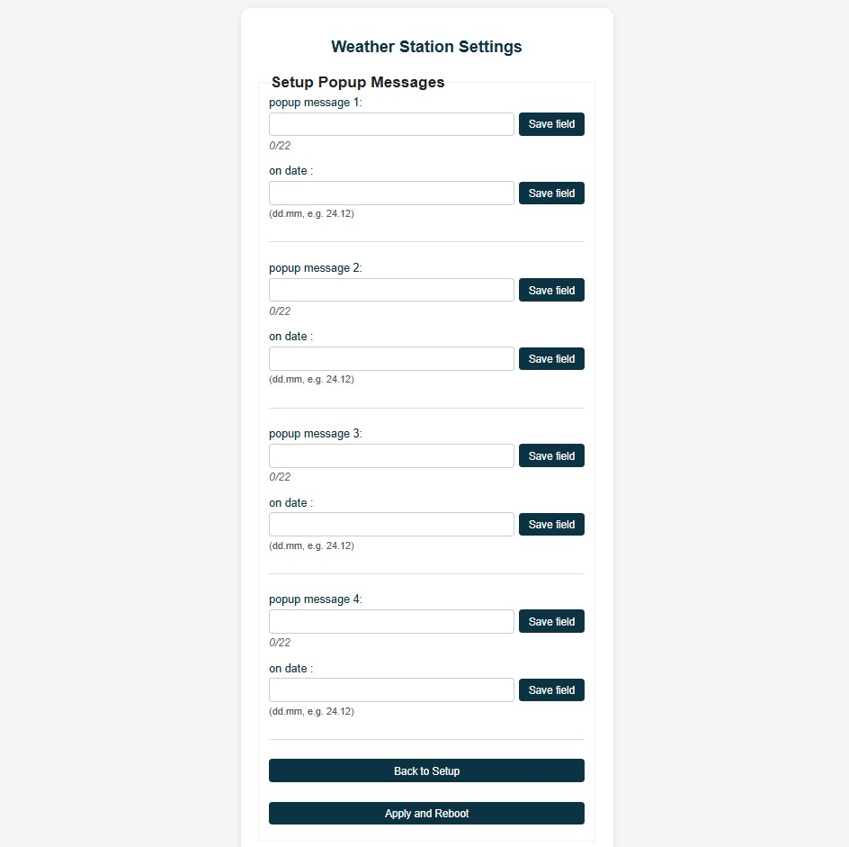
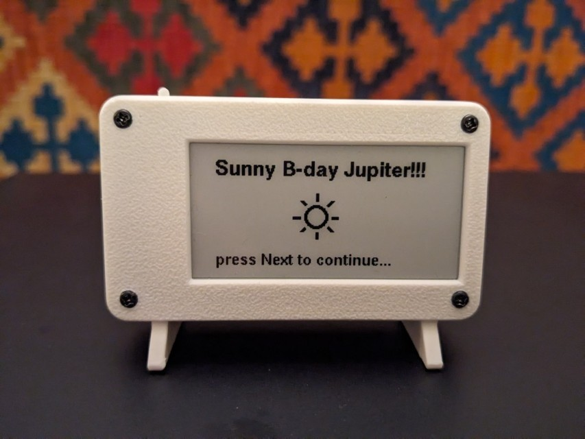

# LilyGo TTGO T5 2.13" ESP32 ePaper weather station

This directory is a fork of David Bird’s ESP32-e-Paper Weather Display project  (© 2014 and beyond): https://github.com/G6EJD/ESP32-e-Paper-Weather-Display

## Features

- Cycling through "current day", "next day" and "4-day" forecast view on button press. Long-press brings up the 4-day forecast right away. 
- WiFi server for web setup of credentials and geographic data (no need to reprogram the controller every time).
- Improved icons (night icons are displayed with a moon symbol instead of a sun).
- Updated display layout for improved readability (optimized for LilyGo 2.13" 250x122 e-Paper display)

- **Popup greetings feature:** displays a recurring message every year on a set date (e.g. birthday greeting).

## Housing 3D model

- The STL design files for 3D printing the housing are included in this repository. This design is based on [Sir.Puchtuning](https://makerworld.com/en/models/647684-lilygo-t5-2-13-small-case?from=search#profileId-1024510)'s project, with added feet and reinforced, optimised structure for 3D printing. 
- The housing can fit a 1000mAh 3.7V battery.
- The front cover can be screwed by M2x10mm screws
- the back part of the feet needs to be attached by glue (separated this way for better printability)

## 📷 Images

## Setup server
The web interface enables setting up credentials, time zone, api key, etc. without reprogramming the controller.

**Usage:** For entering the Weather Station Settings page keep the "next" button pressed while switching the power ON. This will start a WiFi server called "weather_station_wifi". Connect to this and open http://192.168.4.1/

The values will be stored in the EEPROM permanently (even after power loss). Erase using: http://192.168.4.1/erase_eeprom 

## Popup messages

To set up a yearly recurring popup message (up to four), open the (hidden) popup setup page while in setup mode:

http://192.168.4.1/popups

This will show your greeting message every year on the set date:

## Hardware
- ESP32 e-ink display module (~$15): https://lilygo.cc/en-pl/products/t5-2-13inch-e-paper
- Optional: LiPo or LiIon battery with Micro JST 1.25 connector (3.7V, 100-1000mAh)
- 3D printed housing

## Notes
- The default screen refresh period is set to 30 min. The controller is in deep sleep in between. This enables battery life for a couple of months on an 1000mAh 3.7V battery. 

- Recharge the battery via the USB plug.

- This port was built using PlatformIO in VScode.
