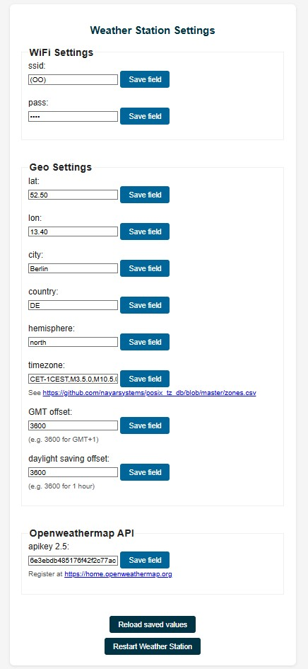

# Lilygo TTGO T5 2.13" ESP32 ePaper weather station

This directory forked from: https://github.com/G6EJD/ESP32-e-Paper-Weather-Display
Based on the [LILYGO TTGO T5 V2.3 2.13](https://lilygo.cc/en-pl/products/t5-2-13inch-e-paper)
board, which incorporates an ESP32 and a 2.13" 250x122 e-ink display.

This for adds a next day and 4-day forecast wiev by pressing the "next" button on the top. The weather icons are also improved and the night icons are diplayed with a moon instead of a sun symbol.

For entering the Weather station setup page, press the button while powering on, then open http://192.168.4.1/

The T5 board is known to have had three different screen revisions, as detailed
[on this github page](https://github.com/lewisxhe/TTGO-EPaper-Series#note).
This port uses the latest recommended screen driver, `GxGDE0213B72B.h`.

The 3D design files are based on the initial design of [Sir.Puchtuning] (https://makerworld.com/en/models/647684-lilygo-t5-2-13-small-case?from=search#profileId-1024510)

This port was built using PlatformIO in VScode.
