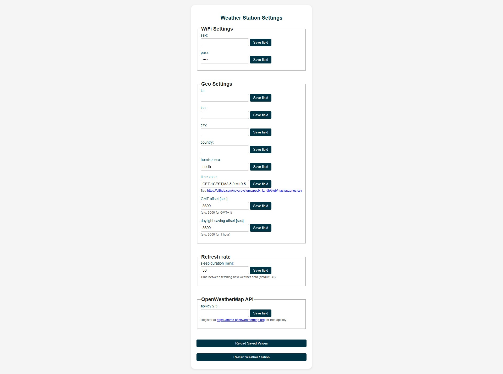

# Lilygo TTGO T5 2.13" ESP32 ePaper weather station

This directory was forked from David Bird’s ESP32-e-Paper Weather Display project  (© 2014 and beyond): https://github.com/G6EJD/ESP32-e-Paper-Weather-Display

## Features

- Updated layout for improved readability.
- Cycling through "current day", "next day" and "4-day" forecast wiev on button press.
- Improved icons (night icons are diplayed with a moon symbol instead of a sun).
- WiFi setup server is implemented for user friendly update of credentials, api key, and geographic data.
- Optimized for LilyGo 2.13" 250x122 e-Paper display.

## Housing for 3D print
The 3D design files for the housing are included in this repository. This design is based on [Sir.Puchtuning](https://makerworld.com/en/models/647684-lilygo-t5-2-13-small-case?from=search#profileId-1024510)'s project, with added feet and reinforced, optimised structure for 3D printing.

## 🔧 Setup server
The setup web interface enables setting up credentials, time zone, api key, etc. without reprogramming the controller. The values are stored in the EEPROM permanently (until erase). 

Usage: For entering the Weather station setup page keep the "next" button pressed while switching the power ON. This will start a WiFi server called "weather_station_wifi". Connect to this and open http://192.168.4.1/

## 📷 Images

## Hardware required
1. Display module: https://lilygo.cc/en-pl/products/t5-2-13inch-e-paper
2. Optional: LiPo or LiIon battery (3.7V, 100-1000mAh)

## Notes
- This port uses the latest recommended screen driver, `GxGDE0213B72B.h`.

- The screen refresh period is set to every 30 min, then the controller goes into sleep mode. Battery life should be many months on a 1000mAh 3.7V battery. Rechargable via the micro USB plug.

- This port was built using PlatformIO in VScode.
