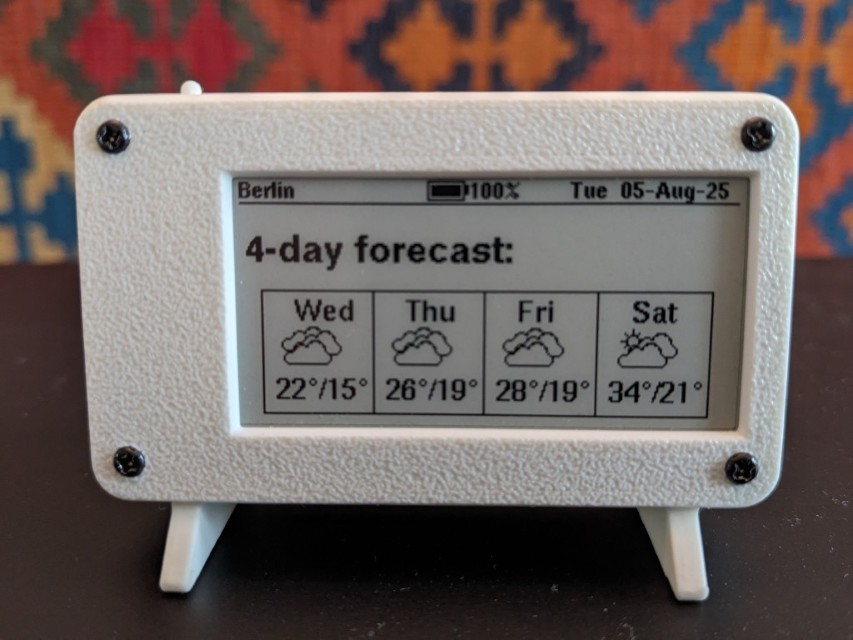

# Lilygo TTGO T5 2.13" ESP32 ePaper weather station

This directory forked from: https://github.com/G6EJD/ESP32-e-Paper-Weather-Display
Based on the [LILYGO TTGO T5 V2.3 2.13](https://lilygo.cc/en-pl/products/t5-2-13inch-e-paper)
board, which incorporates an ESP32 and a 2.13" 250x122 e-ink display.

This fork adds a "next day" and "4-day" forecast wiev by pressing the "next" button on the top. The weather icons are also improved and the night icons are diplayed with a moon instead of a sun symbol.

There is a web interface implemented for setting up credentials, time zone, api key, etc. 
For entering the Weather station setup page keep the "next" button pressed while switching power ON. This will open a WiFi server called "weather_station_wifi". Connect to it and open http://192.168.4.1/

The T5 board is known to have had three different screen revisions, as detailed
[on this github page](https://github.com/lewisxhe/TTGO-EPaper-Series#note).
This port uses the latest recommended screen driver, `GxGDE0213B72B.h`.

The housing 3D design files are based on the initial design of [Sir.Puchtuning](https://makerworld.com/en/models/647684-lilygo-t5-2-13-small-case?from=search#profileId-1024510)

The refresh period is set to every 30 min, then the controller goes into sleep mode. Battery life should be many months on a 1000mAh 3.7V battery. Rechargable via the micro USB plug.

This port was built using PlatformIO in VScode.
